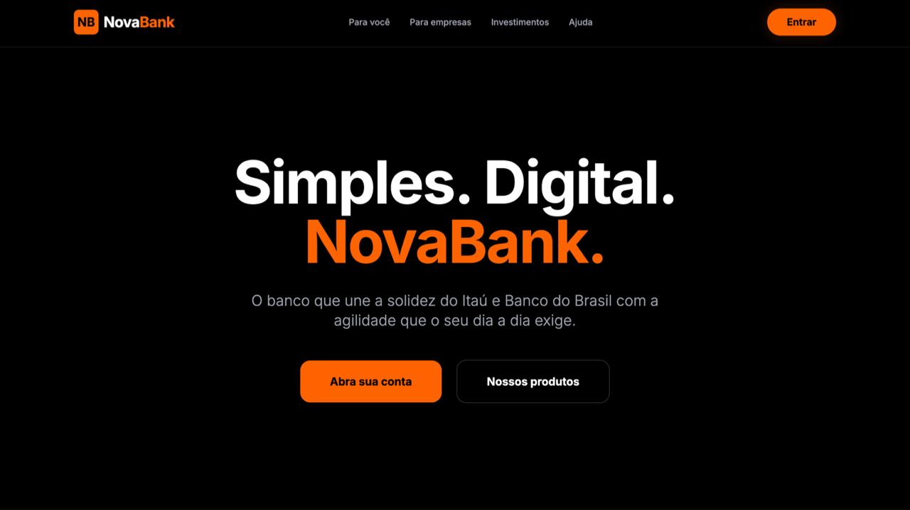

<h1 align="center">
  <strong>Nova Bank – Gestão de Contas e Transações</strong>   🏦🌐💸💳

 

  🪓💻 <strong>Tecnologias Utilizadas: </strong>

   
   
  
  
   
  
  
  
  

<h1 align="center"> 📌 Sobre o Projeto: </h1>

Sistema bancário web em Python + Flask que permite:

- 🏦 Gerenciar contas de usuários;  
- 💸 Realizar depósitos e saques;  
- 📊 Consultar saldo disponível; e  
- 🌐 Interface web interativa e limpa.  

Um sistema bancário é um software que gerencia contas, transações financeiras e histórico de operações, simulando funcionalidades básicas de um banco real.

 

<h1 align="center"> 🗂️ Estrutura do Projeto – NovaBank 🏦🌐💸💳

 </h1>

<pre>
NovaBank/

├── .flaskenv                  # ⚙️ Configuração FLASK_APP=main.py
├── app.py                     # 🚀 Inicialização da aplicação
├── main.py                    # 📝 Arquivo principal
├── wsgi.py                    # 🌐 Deploy WSGI (Vercel)
├── Procfile                   # 📦 Configuração do Vercel
├── LICENSE                    # 📄 Licença do projeto
├── README.md                  # 📄 Este arquivo (**README.md**)
└── requirements.txt           # 📦 Dependências Python e tecnologias
backending/
├── __init__.py                # 📦 Inicializa o pacote
├── banco.py                   # 💰 Funções de contas e transações
├── cores.py                   # 🎨 Constantes de cores para terminal
static/
    img/                       # 🖼️ Logo/imagem da aplicação
      └── novabank.jpeg  
      └── Banco_do_Brasil.jpeg 
      └── Itau.jpeg         
├── warning.js                 # ⚠️ Scripts de alerta
templates/
├── base.html                  # 📄 Template base
├── index.html                 # 🏠 Página inicial
├── patrocinadores.html        # 🏦 Bancos parceiros   
├── tela_inicio.html           # 🔑 Tela de login/início
├── tela_depositarsaldo.html   # 💵 Tela de depósito
├── tela_saquesaldo.html       # 💸 Tela de saque
└── tela_versaldo.html         # 📊 Tela de visualização de saldo
                                

                              
Jinja2 ⛩️
                              

 
</pre>

<h1 align="center"> ⚙️ Versões: </h1>

   
   
   
   
   
   
  
  

<h1 align="center">🚀 Deploy: </h1>

O sistema está pronto para deploy em plataformas que suportam **WSGI**, como o **Render**.
Basta apontar o `wsgi.py` e instalar as dependências listadas em `requirements.txt`.

<h1 align="center">📄 Licença: </h1>

Este projeto está licenciado sob a [MIT License](LICENSE).

<h2 align="center">👨🏻‍💻 Autor deste Repositório: </h2>

Lucas Paguetti Pereira 🧙‍♂️  
🏫 Instuição: Cesar School 🎓🧡  
📍 Recife, Pernambuco — <strong>Brazil</strong> 🇧🇷  

